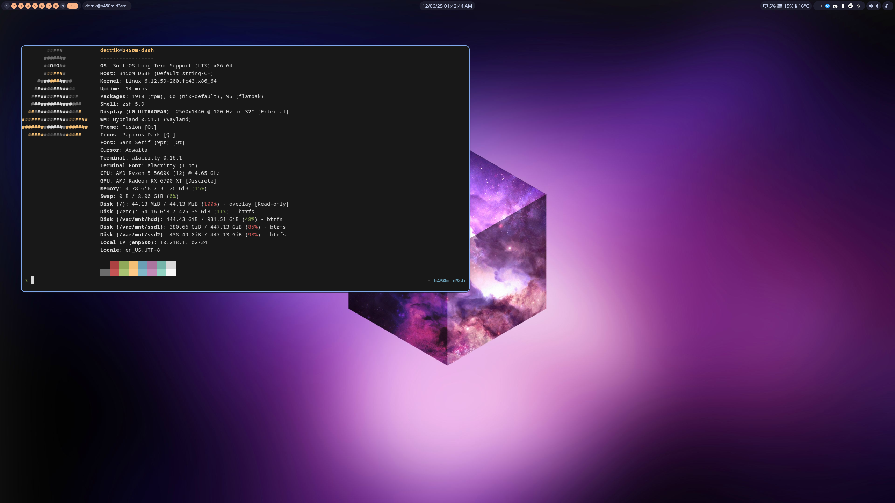

# Soltros Hyprland Configuration



Official Hyprland configuration for [Soltros OS](https://github.com/soltros/Soltros-OS) with a complete Wayland desktop environment featuring Catppuccin Mocha theming.

## Overview

This repository contains a fully configured Hyprland desktop environment with:
- Ashell modern status bar with dynamic modules
- Hyprland window manager with optimized animations and blur effects
- Dunst notification system
- Wofi application launcher
- Hyprlock screen locker
- Hyprpaper wallpaper manager
- Auto-launch applications assigned to dedicated workspaces

## Color Scheme

All components use the **Catppuccin Mocha** color palette:
- Base: `#1e1e2e`
- Mantle: `#181825`
- Surface: `#313244`
- Text: `#cdd6f4`
- Blue: `#89b4fa`
- Sky: `#89dceb`
- Pink: `#f38ba8`
- Peach: `#fab387`
- Yellow: `#f9e2af`
- Green: `#a6e3a1`
- Mauve: `#cba6f7`

## Directory Structure

```
.
├── hypr/
│   ├── hyprland.conf        # Main Hyprland configuration
│   ├── hyprlock.conf        # Screen lock configuration
│   ├── hyprpaper.conf       # Wallpaper configuration
│   └── scripts/
│       └── toggle_floating_waybar.sh  # Floating window + bar toggle
├── ashell/
│   └── config.toml          # Ashell status bar configuration
├── dunst/
│   └── dunstrc              # Notification configuration
└── wofi/
    └── style.css            # Application launcher styling
```

## Components

### Ashell (Status Bar)

**Configuration File:** [ashell/config.toml](ashell/config.toml)

#### Layout:
- **Left:** Workspaces, Window title (truncated at 100 chars)
- **Center:** Clock
- **Right:** SystemInfo, Tray, Settings, MediaPlayer, Privacy

#### Features:
- **Position:** Top of screen across all monitors
- **Log Level:** Configurable (warn/info/debug/error)
- **ESC Key:** Closes open menus
- **App Launcher:** Wofi (`wofi --show drun`)
- **Clock Format:** `%D %r` (date and time)
- **Workspace Filling:** Enabled for better visual consistency
- **Lock Command:** Pauses all media players and launches hyprlock
- **Settings Integration:**
  - Bluetooth: `blueman-manager`
  - Network: `nm-connection-editor`
  - Audio: `pavucontrol`

#### Color Palette (Catppuccin Mocha):
- **Primary:** Peach (`#fab387`) with dark text (`#11111b`)
- **Danger:** Pink (`#f38ba8`)
- **Background:** Graduated layers from base (`#1e1e2e`) to strong (`#45475a`)
- **Success:** Green (`#a6e3a1`)
- **Text Colors:** Configured from dim (`#7f849c`) to bright (`#cdd6f4`)

### Hyprland (Window Manager)

**Configuration File:** [hypr/hyprland.conf](hypr/hyprland.conf)

#### Key Features:
- **Gaps:** 5px inner, 20px outer
- **Border:** 2px width with blue active border (`#89b4fa`)
- **Opacity:** Active windows at 100%, inactive at 90%
- **Rounding:** 10px corner radius
- **Layout:** Dwindle with pseudotiling support
- **Blur:** 8px size, 2 passes, optimized settings
  - Vibrancy: 0.1696, Noise: 0.0117
  - Contrast: 0.8916, Brightness: 0.8172
- **Animations:** Smooth bezier curves (easeOutQuint, easeInOutCubic)

#### Auto-start Applications:
- Ashell (status bar)
- Dunst (notifications)
- Hyprpaper (wallpaper)
- Hypridle (idle management)
- Blueman-applet (Bluetooth)
- Playerctld (media player daemon)
- nm-applet (network manager)
- Clipboard manager (wl-paste + cliphist)
- Steam, Discord, Telegram Desktop, Feishin, Heroic Games Launcher, EasyEffects, Cinny

#### Workspace Assignments:
| Workspace | Application |
|-----------|-------------|
| 2 | Steam |
| 3 | Discord |
| 4 | Telegram Desktop |
| 5 | Feishin (music player) |
| 6 | Heroic Games Launcher |
| 7 | EasyEffects (audio effects) |
| 8 | Cinny (Matrix client) |

#### Key Bindings:

**Window Management:**
- `Super + Return` - Launch terminal (Alacritty)
- `Super + C/Q` - Close active window
- `Super + M` - Exit Hyprland
- `Super + L` - Lock screen (Hyprlock)
- `Super + E` - File manager (Dolphin)
- `Super + F` - Browser (Waterfox)
- `Super + O` - Obsidian
- `Super + R` - Wofi launcher (drun mode)
- `Super + P` - Toggle pseudotiling
- `Super + J` - Toggle split direction
- `Super + V` - Toggle floating with Ashell auto-hide

**Focus Movement:**
- `Super + Arrow Keys` - Move focus between windows

**Workspace Switching:**
- `Super + [0-9]` - Switch to workspace 1-10
- `Super + Shift + [0-9]` - Move window to workspace 1-10
- `Super + Mouse Scroll` - Cycle through workspaces

**Special Workspace (Scratchpad):**
- `Super + Alt + S` - Toggle special workspace
- `Super + Shift + S` - Move window to special workspace

**Screenshots:**
- `Print` - Area screenshot to clipboard
- `Shift + Print` - Area screenshot to file

**Media & System:**
- `XF86AudioRaiseVolume` - Volume up 5%
- `XF86AudioLowerVolume` - Volume down 5%
- `XF86AudioMute` - Toggle mute
- `XF86MonBrightnessUp/Down` - Brightness control
- `XF86AudioPlay/Next/Prev` - Media controls

### Hyprlock (Screen Lock)

**Configuration File:** [hypr/hyprlock.conf](hypr/hyprlock.conf)

#### Features:
- **Grace Period:** 5 seconds before lock activates
- **Background:** Wallpaper with 3-pass blur (size 8)
- **Input Field:** 300x50px, centered, Catppuccin themed
- **Clock Display:** Large bold time (95pt) with date (22pt)
- **Font:** JetBrainsMono Nerd Font
- **Colors:** Blue outline (`#89b4fa`), dark background (`#1e1e2e`)

### Hyprpaper (Wallpaper)

**Configuration File:** [hypr/hyprpaper.conf](hypr/hyprpaper.conf)

- **Wallpaper Path:** `~/wallpapers/default.png`
- **Splash Screen:** Disabled
- **IPC:** Disabled

### Dunst (Notifications)

**Configuration File:** [dunst/dunstrc](dunst/dunstrc)

#### Settings:
- **Position:** Top-right corner (offset 10x50)
- **Size:** 300x300px
- **Notification Limit:** 3 simultaneous
- **Font:** JetBrainsMono Nerd Font 10pt
- **Icon Size:** 32-128px
- **Corner Radius:** 10px
- **Frame:** 2px blue border (`#89b4fa`)
- **Transparency:** 10% transparent background
- **History:** 20 notifications
- **Browser:** Waterfox for notification links
- **Menu Integration:** Rofi for actions

#### Urgency Levels:
- **Low/Normal:** Dark background (`#1e1e2e`), light text (`#cdd6f4`), 10s timeout
- **Critical:** Dark background, pink text (`#f38ba8`), pink frame, no timeout

#### Mouse Actions:
- **Left Click:** Close current notification
- **Middle Click:** Execute action and close
- **Right Click:** Close all notifications

### Wofi (Application Launcher)

**Configuration File:** [wofi/style.css](wofi/style.css)

#### Features:
- **Font:** Hack monospace
- **Theme:** Catppuccin Mocha
- **Border Radius:** 20px outer, 10px input
- **Border:** 1px gray (`#626880`)
- **Input Focus:** Orange glow effect (`#ef9f76`)
- **Selection:** Gray highlight (`#626880`)
- **Alternating Rows:** Slight background variation (`#3C4053`)
- **Background:** `#303446`

## Installation

**On Soltros OS:**

1. Download the **Hyprvibe ISO** (Hyprland edition) from [soltros.dev](https://soltros.dev)

2. After installing Soltros OS, open the terminal and run:
```bash
helper apply-soltros-personal-hyprland
```

This command will automatically backup your existing configurations and deploy the settings from this repository.

**On Other Linux Distributions:**

Place the configuration files in the appropriate directories:
- `hypr/` → `~/.config/hypr/`
- `ashell/` → `~/.config/ashell/`
- `dunst/` → `~/.config/dunst/`
- `wofi/` → `~/.config/wofi/`

Make sure to backup your existing configurations first.

## Dependencies

**Core Components:**
- Hyprland (window manager)
- Ashell (status bar)
- Dunst (notifications)
- Wofi (application launcher)
- Hyprlock (screen locker)
- Hyprpaper (wallpaper manager)
- Hypridle (idle management)

**Utilities:**
- alacritty (terminal)
- dolphin (file manager)
- waterfox (browser)
- rofi (menu/launcher)
- wl-paste, cliphist (clipboard)
- brightnessctl (brightness control)
- wpctl (volume control)
- playerctl (media controls)
- grim, slurp (screenshot tools)
- hyprctl (Hyprland control)
- jq (JSON processing)

**Optional Applications:**
- Steam, Discord, Telegram Desktop
- Feishin (music player)
- Heroic Games Launcher
- EasyEffects (audio effects)
- Cinny (Matrix client)
- Obsidian (notes)
- blueman (Bluetooth manager)
- nm-applet (network manager)
- lm-sensors (GPU temperature monitoring)
- pavucontrol (audio settings)

## Customization

### Changing Wallpaper

Edit both [hypr/hyprpaper.conf](hypr/hyprpaper.conf) and [hypr/hyprlock.conf](hypr/hyprlock.conf):
```conf
# hyprpaper.conf
preload = ~/wallpapers/your-image.png
wallpaper = ,~/wallpapers/your-image.png

# hyprlock.conf
background {
    path = ~/wallpapers/your-image.png
}
```

### Modifying Workspace Assignments

Edit [hypr/hyprland.conf](hypr/hyprland.conf):
```conf
windowrulev2 = workspace 2, class:^(your-app)$
```

Find application class with:
```bash
hyprctl clients
```

### Adjusting Ashell Modules

Edit [ashell/config.toml](ashell/config.toml) to configure module layout:
```toml
[bar.modules]
left = ["workspaces", "window_title"]
center = ["clock"]
right = ["system_info", "tray", "settings", "media_player", "privacy"]
```

Each module can be customized with specific colors, formats, and behavior settings.

### Changing Clock Format

Edit [ashell/config.toml](ashell/config.toml):
```toml
[bar.modules.clock]
format = "%D %r"  # Change to your preferred format
# Examples:
# "%H:%M" - 24-hour time
# "%I:%M %p" - 12-hour with AM/PM
# "%A, %B %d" - Full date
```

### Modifying Ashell Colors

Edit the `[bar.theme.colors]` section in [ashell/config.toml](ashell/config.toml) to customize the color scheme. The configuration uses Catppuccin Mocha by default but can be changed to any palette.

### Key Binding Modifications

Edit [hypr/hyprland.conf](hypr/hyprland.conf) keybind section:
```conf
bind = MODIFIER, KEY, action, parameters
```

Modifiers: `SUPER`, `SHIFT`, `ALT`, `CTRL`

Reload config: `hyprctl reload` (for Hyprland)

## Troubleshooting

### Ashell Not Showing
```bash
# Check if running
pgrep ashell

# Or manually restart
pkill ashell && ashell &
```

### Wallpaper Not Loading
```bash
# Verify file exists
ls -lh ~/wallpapers/default.png

# Restart hyprpaper
pkill hyprpaper && hyprpaper &
```

### Applications Not Auto-launching in Workspaces
```bash
# Check window class
hyprctl clients | grep -i "class"

# Verify windowrulev2 matches the class exactly
```

### GPU Temperature Not Showing (if enabled)
```bash
# Install lm_sensors
sudo dnf install lm-sensors

# Detect sensors
sudo sensors-detect

# Test reading
sensors | grep -i edge
```

### Notifications Not Appearing
```bash
# Check dunst is running
pgrep dunst

# Restart dunst
pkill dunst && dunst &

# Test notification
notify-send "Test" "This is a test notification"
```

### Lock Screen Not Working
```bash
# Verify hyprlock is installed
which hyprlock

# Test manually
hyprlock

# Check wallpaper path in hyprlock.conf
```

## Credits

- **Base Theme:** [ChrisLAS/hyprvibe](https://github.com/ChrisLAS/hyprvibe) (heavily modified)
- **Hyprland:** [hyprwm/Hyprland](https://github.com/hyprwm/Hyprland)
- **Ashell:** Modern Wayland status bar
- **Catppuccin Theme:** [catppuccin/catppuccin](https://github.com/catppuccin/catppuccin)
- **JetBrainsMono Nerd Font:** [ryanoasis/nerd-fonts](https://github.com/ryanoasis/nerd-fonts)

## License

This configuration is released under the MIT License. See [LICENSE](LICENSE) file for details.

## About Soltros OS

[Soltros OS](https://github.com/soltros/Soltros-OS) is an immutable Linux desktop and server operating system built on Fedora CoreOS, designed for gaming and development workloads. Updates are delivered weekly as atomic images with seamless rollback capabilities. The system tracks Fedora's release cycle without disruptive major version upgrades, offering both LTS (stable) and Unstable (alpha/beta) release tracks.

## Author

Maintained by Derrik for [Soltros OS](https://github.com/soltros/Soltros-OS).
